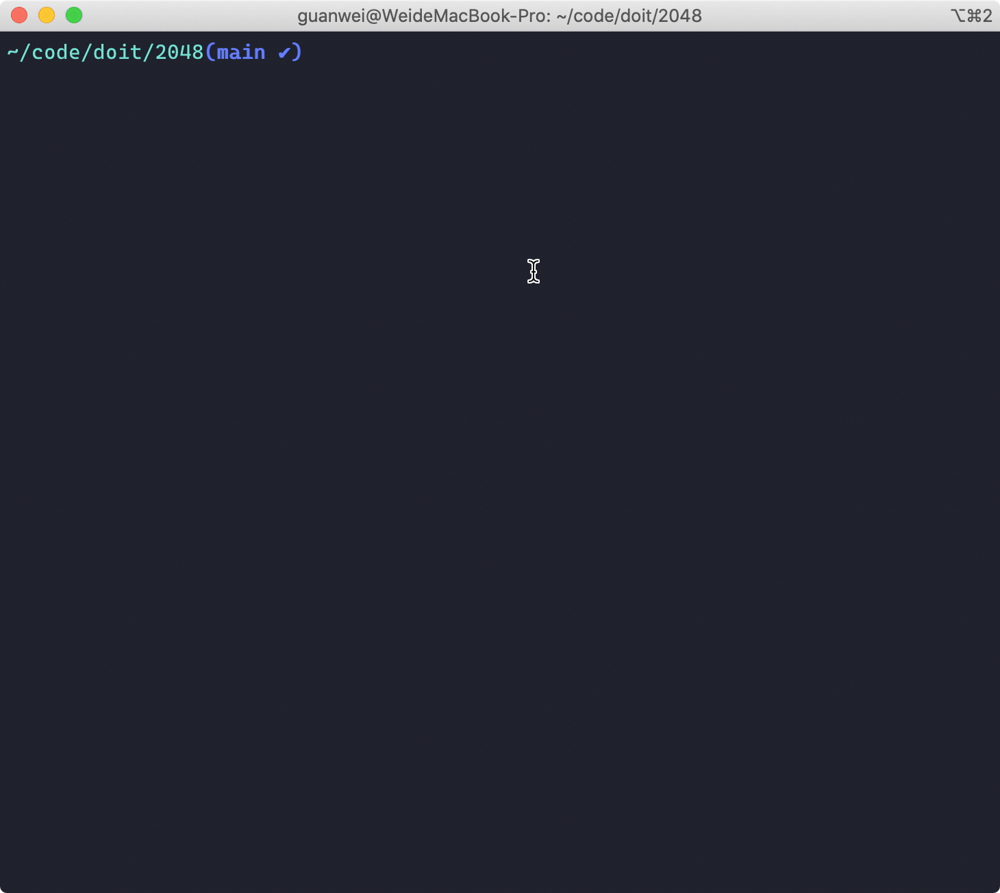

# 2048

> A cli implementation of 2048 game

The source program is [go cli 2048](https://github.com/chhabraamit/2048), just convert by node.js



# run
- node (version > v10)
- yarn or npm

``` cmd
yarn install
yarn start
```
